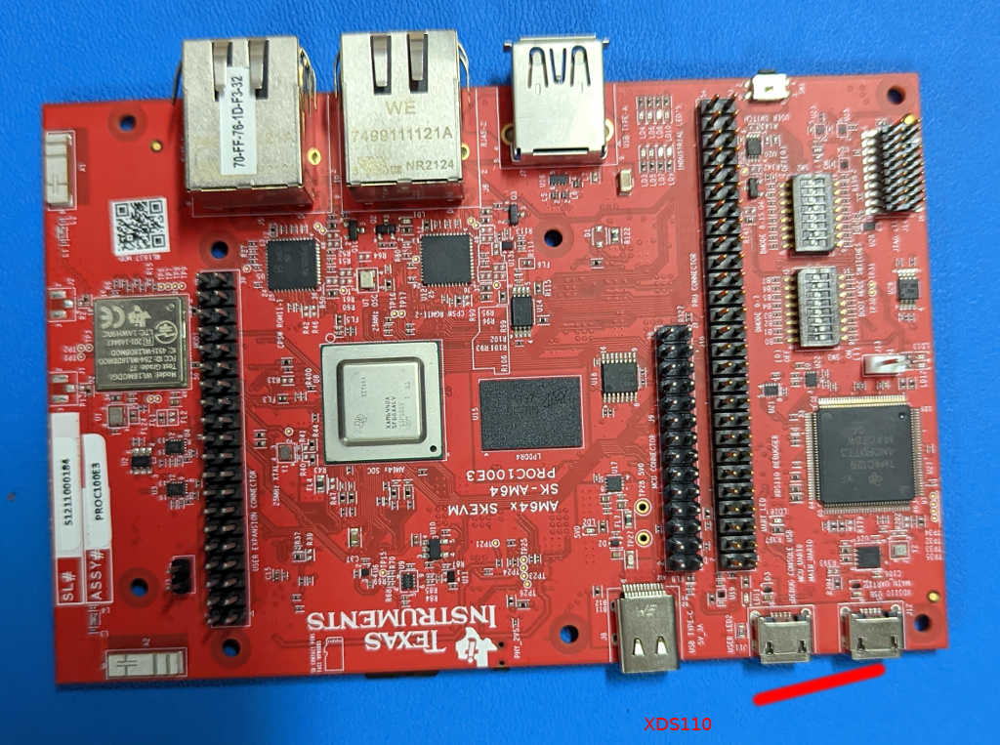
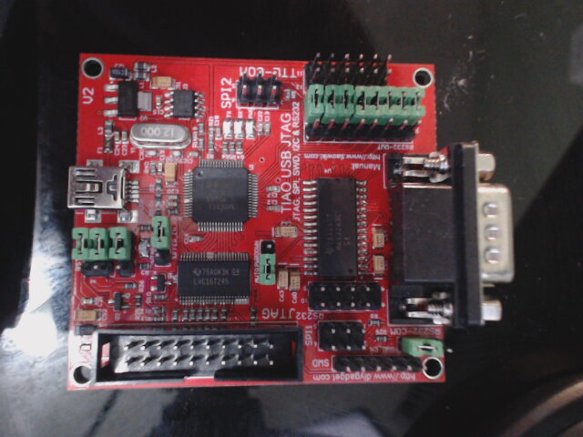

# Welcome to an HowTO with OpenOCD on TI's K3 SoCs

* TOC
{:toc}

# Introduction

System on Chips (SoCs) are complex one way or other. Gone are the days where you can stare at code
and figure out exactly where your code broke, meh.. at least that would be a bit inefficient use of
your time.

## Basic JTAG concept

[JTAG](https://en.wikipedia.org/wiki/JTAG) debugging tools is essential in the toolkit
of an embedded engineer. And it has been always there for eons.

At the very basic level, JTAG is a scan chain as shown in the following picture from wikipedia

There is a clock, and data goes in, and data comes out, and it daisy chains from one device to the next.

However, most of us dont work at the signal level. Instead, we use this to communicate with an internal
hardware block that in turn allows us to talk to actual processors, since that is where the fun stuff is..

For example, when working with TI Processors, the debuggers that people get started with is 
[Code Composer Studio (CCS)](https://en.wikipedia.org/wiki/Code_Composer_Studio) and sometimes, [Lauterbach](https://en.wikipedia.org/wiki/Lauterbach_(company)).

## Code Composer Studio (CCS)
The following image shows how such a communication looks like with CCS. The JTAG debugger you
would probably use in this case might be an [XDS560](https://www.ti.com/tool/TMDSEMU560V2STM-U) or 
on the cheaper end [xds100v2](https://www.ti.com/tool/TMDSEMU110-U)

You can ofcourse find a lot more details in [CCS getting started page](https://software-dl.ti.com/ccs/esd/documents/users_guide/ccs_debug-main.html)

Much of this is ofcourse developed inhouse, inside TI. Ofcourse, there are similar tools from
various SoC manufacturer as well.

## Lauterbach (Trace32)

At an industry level, Lauterbach or Trace32 (as people like to call it), is a much venerated debugger.
So much so that it that some call it the "lamborghini" for debugging. Their offerings are
[varied](https://www.lauterbach.com/frames.html?powerdebugpro.html) with functionality scaling
scaling way up into pretty much fancy features. But then, when you pay the top \$, you do expect
to get the \$ worth of features..

Usage model mostly follows a similar sequence of debugger (with so called dongle)+ IDE interfacing
with the jtag signals (in some cases, additional trace signalling) and providing a view to the user
from different perspectives (from Processor, or from debug system etc)

## openOCD

And then, one of the most cost effective option is [openOCD](https://openocd.org/)

This gets a little interesting.

To understand openOCD, you'd want to understand the basics of [GDB](https://en.wikipedia.org/wiki/GNU_Debugger)
GDB, natively is used to debug any Linux application. There are quite a many excellent tutorials on gdb online.

Basic steps of this process:
* Build your application with debug symbols
* Run debugger on your application, step and debug.

Some useful references:
* [https://developers.redhat.com/blog/2021/04/30/the-gdb-developers-gnu-debugger-tutorial-part-1-getting-started-with-the-debugger](https://developers.redhat.com/blog/2021/04/30/the-gdb-developers-gnu-debugger-tutorial-part-1-getting-started-with-the-debugger)
* [https://opensource.com/article/21/1/gnu-project-debugger](https://opensource.com/article/21/1/gnu-project-debugger)

One of the cool features of using gdb is the ability to split the debugger with the [gdbserver](https://en.wikipedia.org/wiki/Gdbserver)

Linux kernel, for example, provides [kgdb](https://www.kernel.org/doc/html/v5.18/dev-tools/kgdb.html) that works on the same concept.

OpenOCD is built on the same concept. openOCD is the "gdbserver" which talks to gdb, and the IDE of your choice then talks to gdb.

# K3 Options for connecting physical JTAG

## Platforms with onboard XDS110

TI K3 SoC evaluation Modules typically do include xds110 debugger onboard, this allows the board to be directly connected to
Debuggers such as CCS or OpenOCD. This is typically a micro USB port on the board.

On these boards, you just need micro USB cable and plug your PC to the board and you are good to go.

### AM62 SK

[https://www.ti.com/tool/SK-AM62](https://www.ti.com/tool/SK-AM62)

### AM64 EVM

[https://www.ti.com/tool/TMDS64GPEVM](https://www.ti.com/tool/TMDS64GPEVM)

### AM64 SK

[https://www.ti.com/tool/SK-AM64](https://www.ti.com/tool/SK-AM64)

### AM654 EVM

[https://www.ti.com/tool/TMDX654GPEVM](https://www.ti.com/tool/TMDX654GPEVM)

### J7200 EVM

[https://www.ti.com/tool/J7200XSOMXEVM](https://www.ti.com/tool/J7200XSOMXEVM)

### J721E EVM

[https://www.ti.com/tool/J721EXSOMXEVM](https://www.ti.com/tool/J721EXSOMXEVM)

## Platforms with JTAG Connectors

Sadly, some boards however do not include onboard debugger. These require an external debugger to be used with cables and connectors to get JTAG debugging functional.
Unfortunately, it is a mayhem of connectors, cables and adpaters and standards to deal with here.

Debugger that works best and with the least hassle is the [TUMPA (TIAO USB Multi-Protocol Adapter)](https://www.diygadget.com/jtag-cables-and-microcontroller-programmers/tiao-usb-multi-protocol-adapter-jtag-spi-i2c-serial)

### J721E BeagleBone AI64

[https://beagleboard.org/ai64](https://beagleboard.org/ai64)

Unfortunately, with the heatsink on, this gets a little tricky to mount.

For this board, that uses a standard ARM Tagconnect interface, you need some additional cables and connectors.
* [https://www.tag-connect.com/product/tc2050-idc-nl-10-pin-no-legs-cable-with-ribbon-connector](https://www.tag-connect.com/product/tc2050-idc-nl-10-pin-no-legs-cable-with-ribbon-connector)
* [https://www.tag-connect.com/product/tc2050-clip-3pack-retaining-clip](https://www.tag-connect.com/product/tc2050-clip-3pack-retaining-clip)
* [https://www.tag-connect.com/product/tc2050-arm2010-arm-20-pin-to-tc2050-adapter](https://www.tag-connect.com/product/tc2050-arm2010-arm-20-pin-to-tc2050-adapter)

With the tagconnect adapter, you need to solder bridge trst signal

If you do own a 3D printer, you might also want to look at the following (the retaining clips are notorious to loose):
* [https://www.thingiverse.com/thing:3025584](https://www.thingiverse.com/thing:3025584)
* [https://www.thingiverse.com/thing:3035278](https://www.thingiverse.com/thing:3035278)

When put together, it looks like this

### J721E SK

[https://www.ti.com/tool/SK-TDA4VM](https://www.ti.com/tool/SK-TDA4VM)

This is more of the convention of most of the traditional TI EVM designs. with a TI header requiring yet another set of custom cables and adapters.

* [https://www.tag-connect.com/product/20-pin-cortex-ribbon-cable-4-length-with-50-mil-connectors](https://www.tag-connect.com/product/20-pin-cortex-ribbon-cable-4-length-with-50-mil-connectors)
* Sadly [https://www.tincantools.com/product/arm20cti20-cti-20-pin-jtag-adapter-board/](https://www.tincantools.com/product/arm20cti20-cti-20-pin-jtag-adapter-board/) is out of stock :(
* [https://www.segger.com/products/debug-probes/j-link/accessories/adapters/ti-cti-20-adapter/](https://www.segger.com/products/debug-probes/j-link/accessories/adapters/ti-cti-20-adapter/)
* [https://www.lauterbach.com/ad3780.html](https://www.lauterbach.com/ad3780.html) ( I believe I used a Lauterbach LA-3780)

You do want to be careful about the signalling though.
[https://software-dl.ti.com/ccs/esd/xdsdebugprobes/emu_jtag_connectors.html](https://software-dl.ti.com/ccs/esd/xdsdebugprobes/emu_jtag_connectors.html) is something to be aware of when buying off the shelf adapters.

When put together, it looks like this:
